1. Обновляем списки пакетов: 
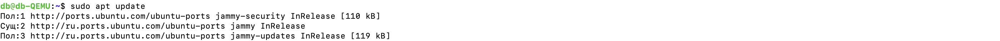
2. Установите пакеты, которые позволят использовать репозиторий по HTTPS:
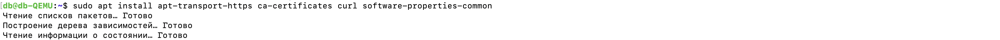
3. Добавляет официальный GPG-ключ Docker, 
добавляем репозиторий Docker к списку источников пакетов:
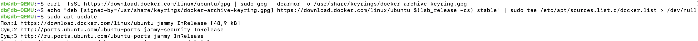
4. Добавляем пользователя в группу docker, чтобы избежать использования sudo для запуска Docker команд:
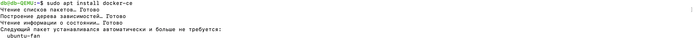
6. Проверяем работу:
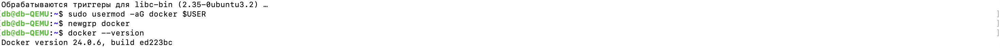
7. Запускаем контейнер с использованием образа "cowsay":
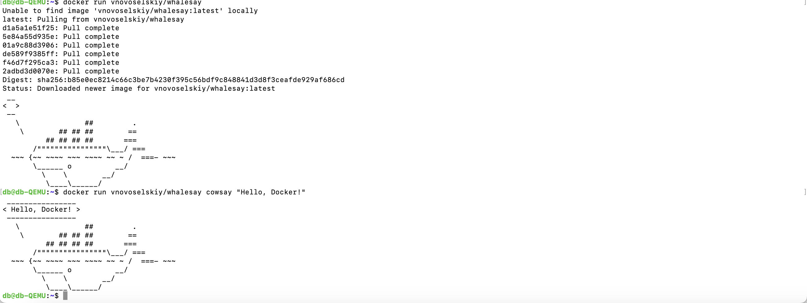
8. Создаем еще один контейнер (с драконом):  
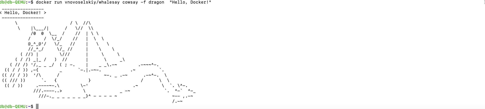
9. Просматриваем и удаляем контейнер (по айди):  
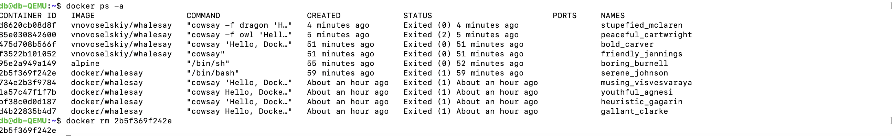
10. Запускаем контейнер из образа Ubuntu и входим в него, проверяем его наличие.
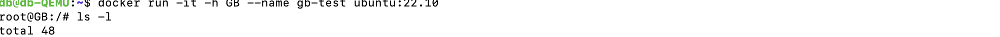
11. Также создадим новую директорию в корневой папке. В директории example создаем новый файл.
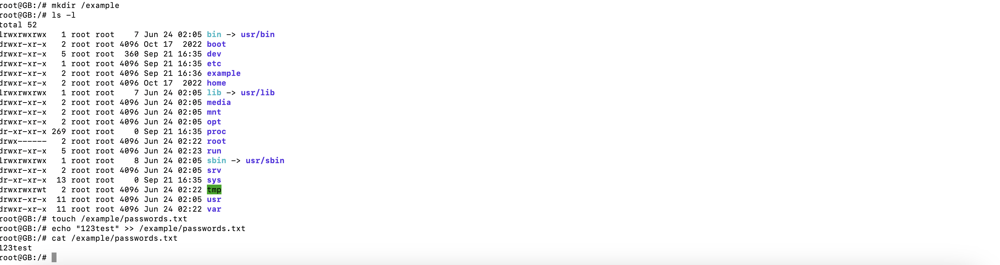
12. Остановить и запустить контейнер:
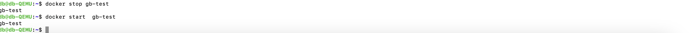