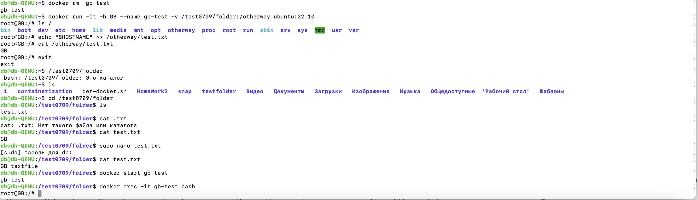

1. Обновляем списки пакетов: 

2. Установите пакеты, которые позволят использовать репозиторий по HTTPS:

3. Добавляет официальный GPG-ключ Docker, 
добавляем репозиторий Docker к списку источников пакетов:

4. Добавляем пользователя в группу docker, чтобы избежать использования sudo для запуска Docker команд:

5. Проверяем работу:

6. Запускаем контейнер с использованием образа "cowsay":

7. Создаем еще один контейнер (с драконом):  

8. Просматриваем и удаляем контейнер (по айди):  

9. Запускаем контейнер из образа Ubuntu и входим в него, проверяем его наличие.

10. Также создадим новую директорию в корневой папке. В директории example создаем новый файл.

11. Останавливаем и запускаем контейнер:

12. Удаляем контейнер. Создаем контейнер из образа ubuntu:22.10 и задаем ему имя и hostname.
Создаем папку, файл и наполняеем его данными. 
