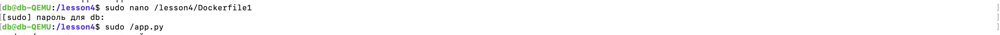

1. Создаем Docker-файл, в котором будем создавать контейнер. Создаем приложение. 

2. Переходим в приложение и пишем его. Пишем код для приложения. 

3. Создаем инструкцию для сборки образа. Используем последний образ Ubuntu. Обновляем список пакетов.
Устанавливаем пакет 'python3'. Копируем приложение.
Задаем команду, которая будет выполняться при запуске контейнера.

4. Собираем контейнер, запускаем его и промеряем корректность работы. 
5. 

