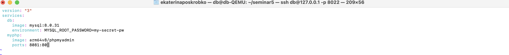
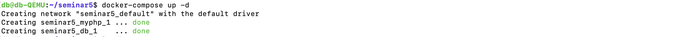
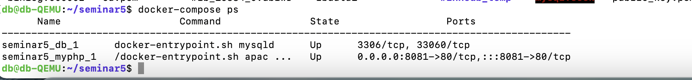
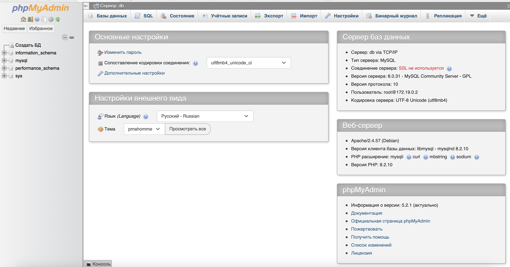

<b>Задание. Cоздать сервис, состоящий из 2 различных контейнеров: 1 - веб, 2 - БД (compose).</b>
1. Создаем директорию для работы в ней: mkdir seminar5.
2. Создаем файл с расширением .yml и переходим в него в редакторе vim.

3. Описываем yml-файл.

4. Собираем. 

5. Проверяем запущены ли контейнеры.

6. Открываем браузер и переходим в контейнеры.
